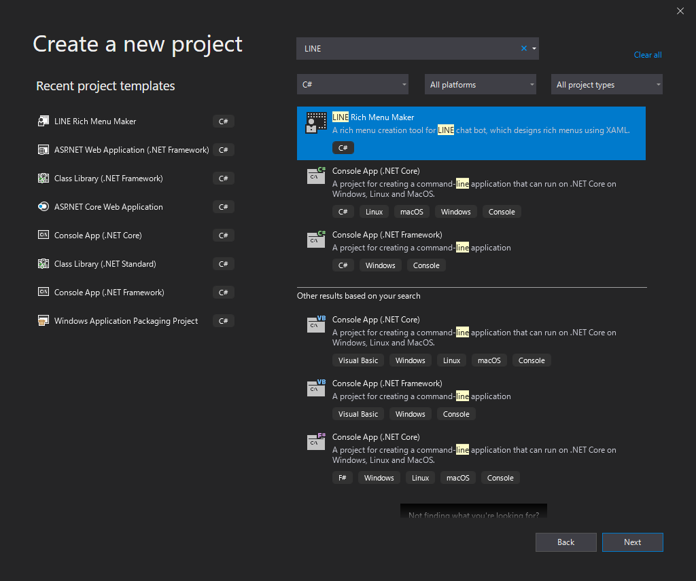
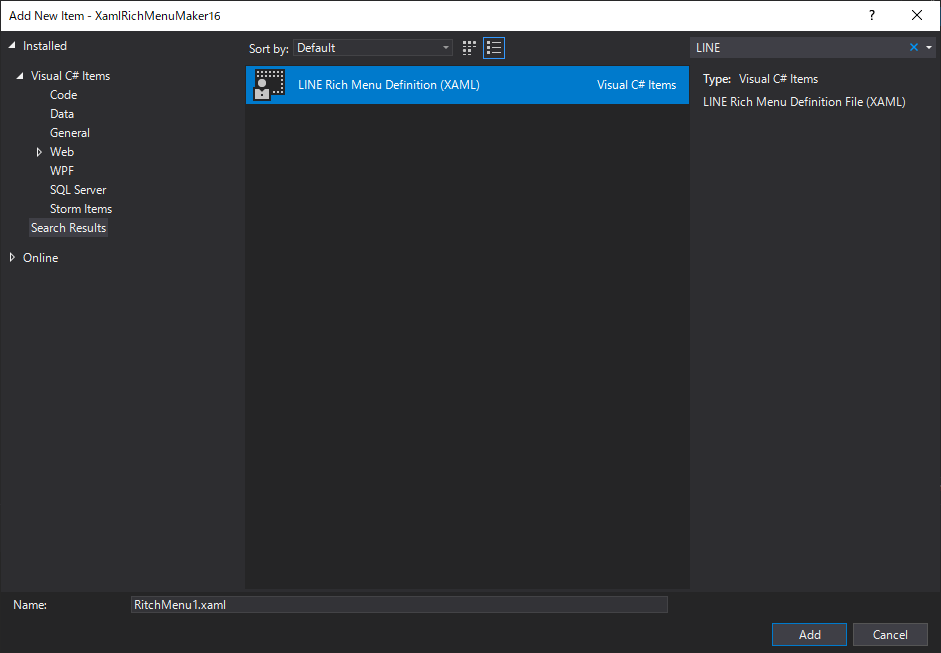
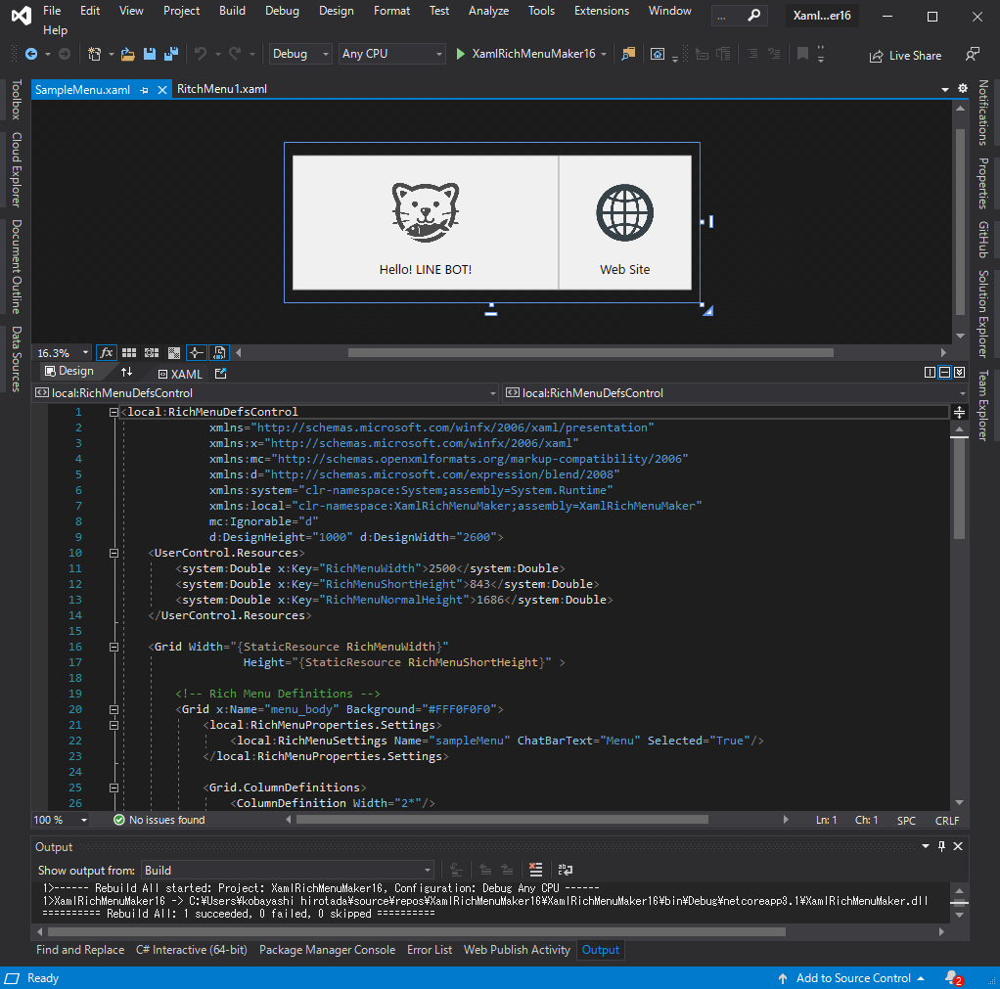
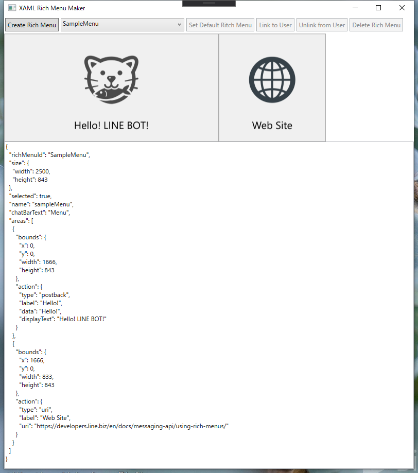
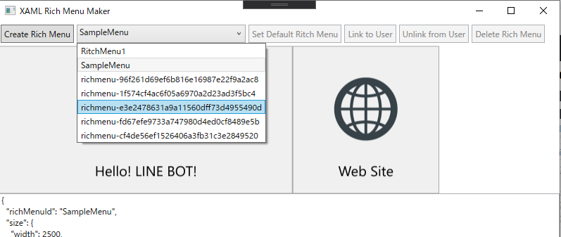

# XamlRichMenuMaker
XamlRichMenuMaker is a rich menu creation tool for LINE chat bot, which designs rich menus using XAML.

## Visual Studio Extension Tool

This tool has been released as an extension of Visual Studio.

- Visual Studio Marketplace  
  https://marketplace.visualstudio.com/items?itemName=pierre3.xrmm100

## Usage

### Creating an XAML Ritch Menu Maker project

- Click [File]>[New]>[Project] in the Visual Studio menu bar, select [LINE Ritch Menu Maker] in the [Create New Project] dialog, and click [Next].



- Enter a project name and click "Create" to create the XAML Ritch Menu Maker project.
- Once the project has been created, go to the menu [Build] > [Build Solution] and run the build only once.

### Setting up a BOT account
Set up a BOT account to use the Rich Menu.

- In Solution Explorer, click on "appsettings.json" to open the edit screen.
- Enter the "Channel Access Token" of the LINE Bot in the `ChannelAccessToken` field.
- In the `DebugUserId` field, enter your own user ID, which can be found in the Other section of the Basic Channel Settings page of LINE Developers under Your user ID (optional).

```json
{
    "AppSettings": {
        "ChannelAccessToken": "+CiR37Hw0xxxxxxxxxxxxxxxxxxxxx",
        "DebugUserId": "U28aa2xxxxxxxxxxxxxxxxxxxxx"
    }
}
```

### Designing a rich menu in the XAML editor

#### Create a rich menu definition file (XAML)

- Right-click on the "RichMenuDefs" folder in Solution Explorer
- In the menu that appears, click [Add] > [New item...]
- Select "LINE Rich Menu Definition (XAML)" in the Add New Item dialog, enter a file name and click "Add".



The following XAML files will be created. Edit this to design a rich menu.

```xml
<local:RichMenuDefsControl 
             xmlns="http://schemas.microsoft.com/winfx/2006/xaml/presentation"
             xmlns:x="http://schemas.microsoft.com/winfx/2006/xaml"
             xmlns:mc="http://schemas.openxmlformats.org/markup-compatibility/2006" 
             xmlns:d="http://schemas.microsoft.com/expression/blend/2008" 
             xmlns:local="clr-namespace:XamlRichMenuMaker;assembly=XamlRichMenuMaker"
             xmlns:system="clr-namespace:System;assembly=System.Runtime"
             mc:Ignorable="d" 
             d:DesignHeight="1000 "d:DesignWidth="2600">
    <UserControl.Resources>.
        <system:Double x:Key="RichMenuWidth">2500</system:Double>
        <system:Double x:Key="RichMenuShortHeight">843</system:Double>
        <system:Double x:Key="RichMenuNormalHeight">1686</system:Double>
    </UserControl.Resources>

    <Grid Width="{StaticResource RichMenuWidth}" 
                  Height="{StaticResource RichMenuShortHeight}">
        <Grid x:Name="menu_body" Background="LightGray">
            <local:RichMenuProperties.Settings>
                <local:RichMenuSettings Name="" ChatBarText="" Selected="True"/>
            </local:RichMenuProperties.Settings>

            <! -- Design your rich menu layout here.

        </Grid>
    </Grid>
</local:RichMenuDefsControl>

```

#### Setting the Rich Menu

##### Setting the height of the rich menu
The size of the rich menu is specified by the width and height of the outermost grid.  
When the file is created, the height of the Short size is specified. If you want to create a large rich menu, change the height to `RichMenuNormalHeight`.

```xml
<Grid Width="{StaticResource RichMenuWidth}" 
      Height="{StaticResource RichMenuNormalHeight}">
</Grid>
```

##### Setting the entire rich menu

The grid control tagged `x:Name=menu_body` will be saved as a rich menu image.
Set the following values for this Grid.

- Specify the background color of Grid in the Background property of Grid.
- You can specify various settings of menu registration in attached property RichMenuProperties.
Items to be specified include the following

  - Name: Rich menu name
  - ChatBarText: The text displayed in the menu bar below the LINE chat screen
  - Selected: True if the rich menu is displayed by default.


#### Designing the look of a rich menu
The appearance of the rich menu is designed by placing the controls in the Grid `menu_body`.
  
From here, we'll use SampleMenu.xml in the RichMenuDefs folder of the project we created as an example.



Define two button areas with Grid, add an icon image with Image control, and set the caption of the button with TextBlock.

```xml
<! -- Create two columns and set the ratio of the width of the first to the second to 2:1 -->
<Grid.ColumnDefinitions>
    <ColumnDefinition Width="2*"/>
    <ColumnDefinition/>
</Grid.ColumnDefinitions>

<! -- image and caption of the first button -->
<Image Source=". /Resources/cat.png"
            VerticalAlignment="Top"
            Margin="0,150,0,0" Width="420" Height="420"/>
<TextBlock Margin="0,0,0,0,80" VerticalAlignment="Bottom" 
                HorizontalAlignment="Center" 
                FontSize="80">
        Hello! LINE BOT!
</TextBlock>

<! -- image and caption for the second button -->
<Image Grid.Column="1" Source=". /Resources/web.png"
            VerticalAlignment="Top"
            Margin="236.333,180,237,0" Width="360" Height="360"/>
<TextBlock Grid.Column="1" Margin="0,0,0,0,80" VerticalAlignment="Bottom" 
                HorizontalAlignment="Center" 
                FontSize="80">Web Site
</TextBlock>
```

##### Action area setting
Next, we define an area in the rich menu that acts as a button (= action area). There are two items to define

- Bounds: coordinates of the action area
- Action: The action to be taken when an area is tapped.

Bounds uses the coordinates of the control tagged with x:Name="area_{n}" (where n is a number from 1 to 20).   
In the sample example, the Rectangle control is also used to display the boundaries of the buttons, but you can use other controls as well.  
  
Action for tapping an area is defined by setting the attached property RichMenuProperties.Action to the above control.

```xml
<! -- Action Area 1 -->
<Rectangle x:Name="area_1"
        Stroke="DarkGray" StrokeThickness="4">
    <local:RichMenuProperties.Action>
        <local:RichMenuAction Type="Postback" Label="Hello!" Data="Hello!" Text="Hello! LINE BOT!" />
    </local:RichMenuProperties.Action>
</Rectangle>
```

The following four types of actions can be specified

- Postback
- Message
- URI
- Datetimepicker

Please refer to the following for the setting items required for each action.  
[Action Object: Messaging API Reference](https://developers.line.biz/ja/reference/messaging-api/#action-objects)


### Creating a rich menu using the Messaging API
Once you're done designing in XAML, you can use the LINE Messaging API to create a rich menu.  

Press [Ctrl]+[F5] to run the application.  
When the application is launched, the rich menu image designed in XAML and the JSON content sent to the LINE side using the Messaging API will be displayed, as shown below.



Confirm the content and click the "Create Rich Menu" button if it is OK.    
Now you've created and uploaded your rich menu!

#### Checking a created or registered rich menu

When you open the combo box on the right side of the [Create Rich Menu] button, you will see the already registered Rich Menu ID (a string starting with "richmenu-") under the rich menu name (XAML file name) defined in the XAML file.



By selecting these, you can check the contents of the rich menu (image, JSON).

In addition, the following operations are available for the selected rich menu.

- [Set Default Rich Menu]: Set as default rich menu for Bot account
- [Link to User]: associate it with the LINE user for debugging (specified as DebugUserId in appsettings.json)
- [Unlink from User]: Remove the association from the LINE user for debugging
- [Delete Rich Menu]: Delete the rich menu.


